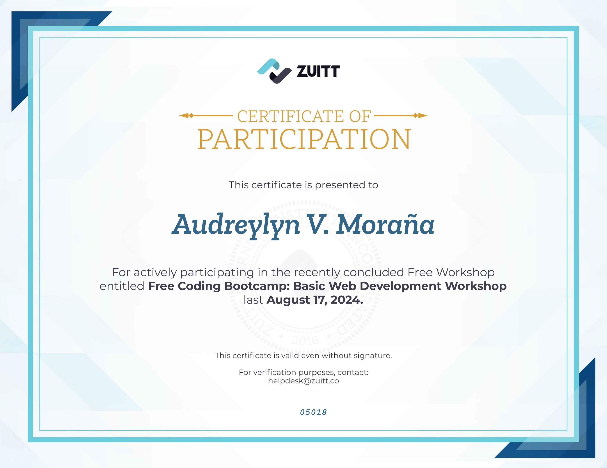

# README

## Free Coding Bootcamp: Basic Web Development Workshop

This project is a personal web development portfolio created as part of my active participation in the **Free Coding Bootcamp: Basic Web Development Workshop** hosted by Zuitt on **August 17, 2024**. The project is designed to showcase my skills in full-stack web development and is a demonstration of what I learned during the workshop.

### Features
- **Responsive Layout**: The page is designed to be fully responsive and adjusts to various screen sizes, ensuring compatibility with both desktop and mobile devices.
- **Bootstrap Integration**: Utilizes the Bootstrap framework to help with responsive layout and styling.
- **Google Fonts**: Integrates Google Fonts for typography, using Montserrat and Roboto fonts.
- **Font Awesome Icons**: Social media icons are created using Font Awesome.

### Technologies Used
- **HTML5**: The foundational structure and markup for the web page.
- **CSS3**: Used for styling and layout, with external CSS for custom styles.
- **Bootstrap 5**: For responsive design and UI components.
- **Font Awesome**: To display icons for social media links.
- **Google Fonts**: For custom typography styles.

### Certification
I received a certification for completing the workshop, which can be seen below:

### Acknowledgments
I would like to extend my gratitude to **Zuitt** for organizing the workshop, and for providing me with the tools and knowledge to grow as a web developer.
